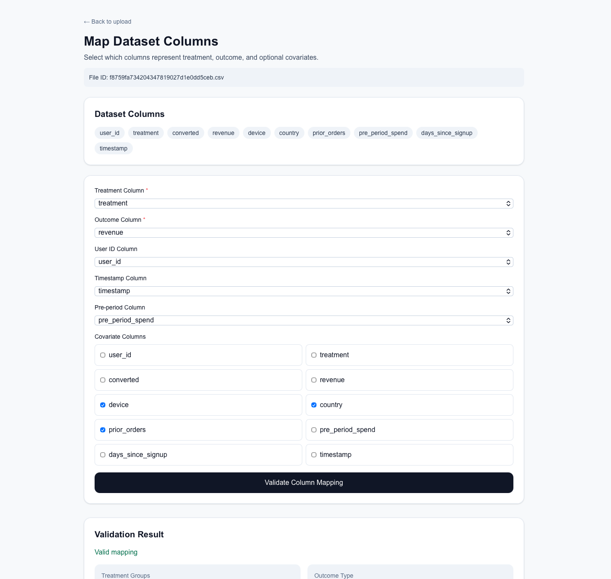
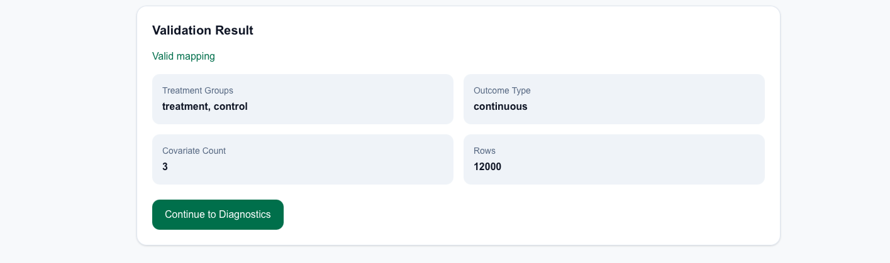
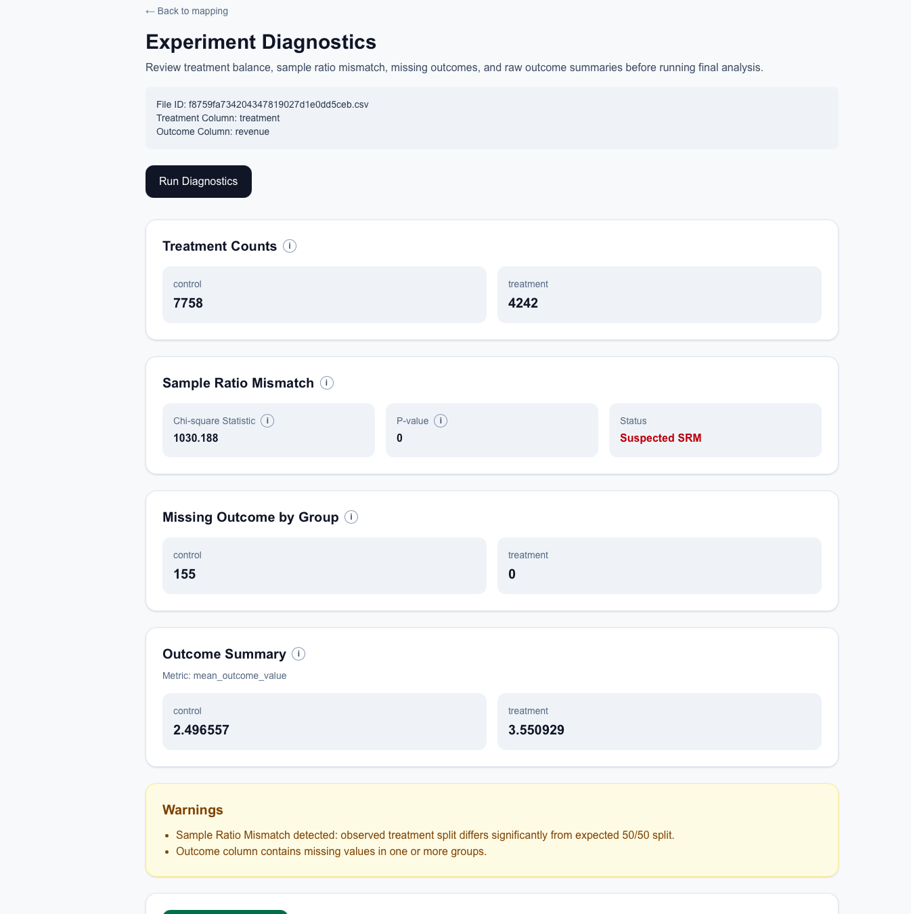
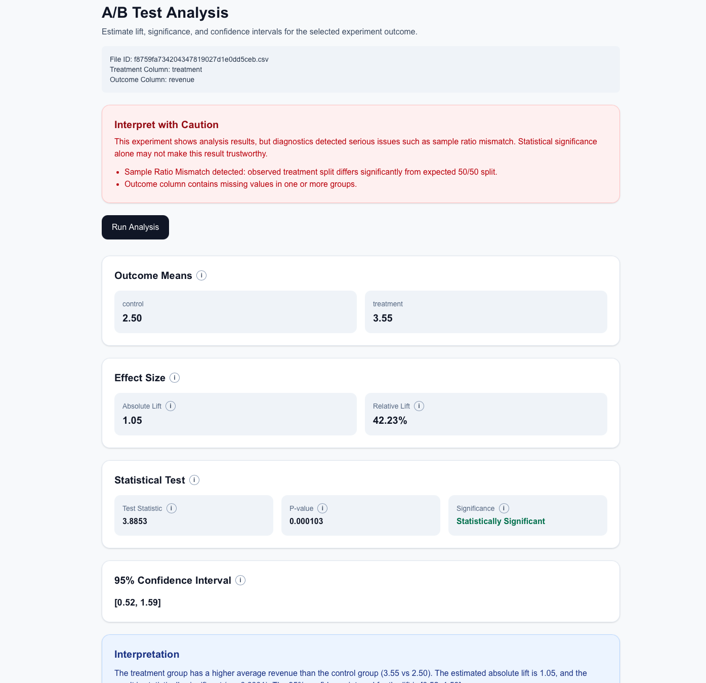
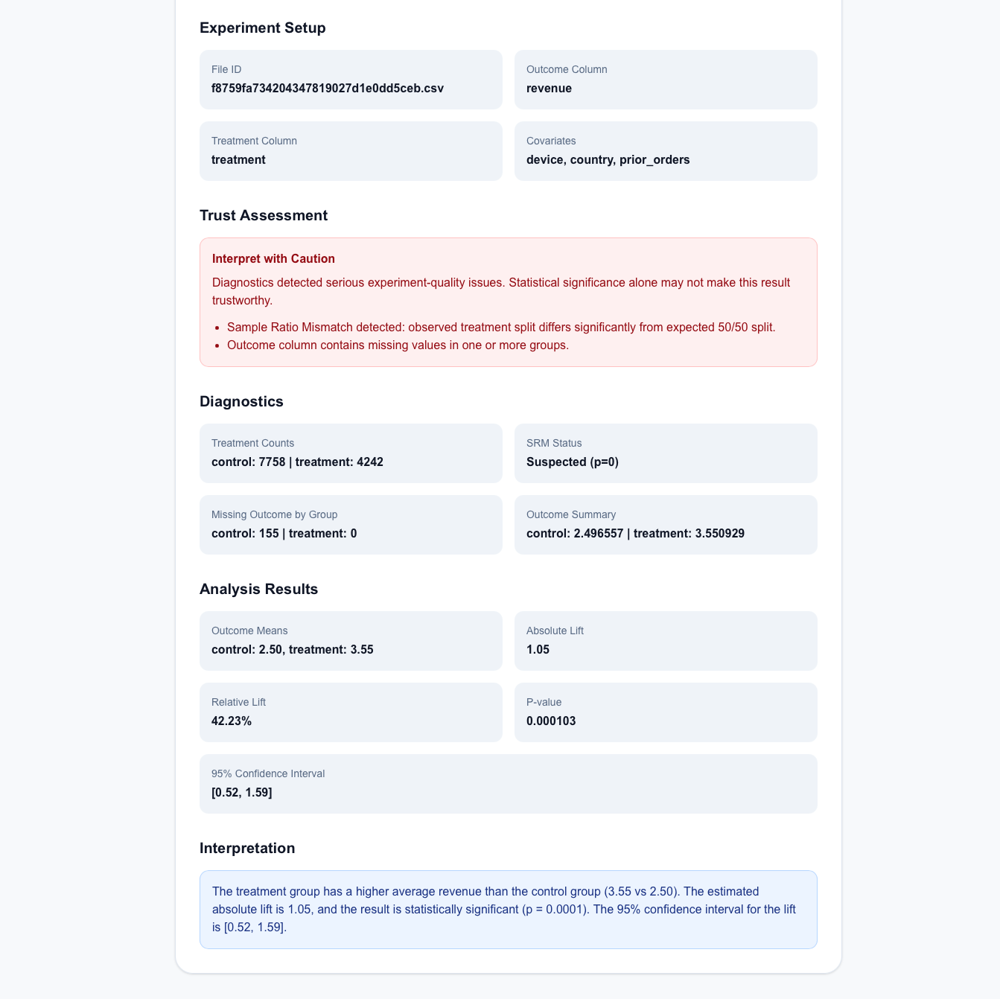

# CausalLab — Experimentation Review and A/B Test Analysis Platform

CausalLab is a full-stack platform for reviewing randomized A/B test datasets with diagnostics, statistical analysis, trust-aware reporting, and LLM-generated stakeholder summaries.

## Overview

Teams often focus only on p-values and lift, even when the experiment itself may be flawed. CausalLab is designed to separate:

- **statistical effect estimation**
- **experiment trustworthiness**

The platform helps users upload an experiment dataset, map treatment and outcome columns, validate the setup, run diagnostics, estimate treatment effects, and generate stakeholder-friendly reports.

## Key Features

### Dataset Ingestion and Validation
- Upload CSV datasets through a web interface
- Profile dataset schema and preview rows
- Dynamically map treatment, outcome, ID, timestamp, pre-period, and covariate columns
- Validate column mapping before analysis

### Experiment Diagnostics
- Treatment group counts
- Sample Ratio Mismatch (SRM) detection
- Missing outcome checks by group
- Raw outcome summaries by group
- Trust-aware warnings carried into downstream reporting

### Statistical Analysis
#### Binary outcomes (for example: `converted`)
- Conversion rates by group
- Absolute lift
- Relative lift
- Two-proportion z-test
- 95% confidence interval

#### Continuous outcomes (for example: `revenue`)
- Mean outcome by group
- Absolute lift
- Relative lift
- Welch’s t-test
- 95% confidence interval

### Reporting and Stakeholder Communication
- Trust-aware analysis page
- Printable report page
- LLM-generated:
  - Executive Summary
  - Reliability Note
  - Recommendation

## Why It Matters

A statistically significant result is not always a trustworthy result.

CausalLab is designed to answer two separate questions:

1. **Did the treatment outperform control?**
2. **Is the experiment reliable enough to trust that conclusion?**

That distinction is one of the most important design choices in the project.

## Tech Stack

### Frontend
- Next.js
- TypeScript
- Tailwind CSS

### Backend
- FastAPI
- Python
- pandas
- SciPy

### LLM Layer
- OpenAI API

### Deployment
- Vercel (frontend)
- Render (backend)

## Architecture

```text
CausalLab/
├── backend/
│   ├── app/
│   │   ├── api/routes/
│   │   ├── models/
│   │   ├── services/
│   │   └── utils/
│   ├── uploads/
│   ├── reports/
│   ├── scripts/
│   └── requirements.txt
├── frontend/
│   ├── app/
│   ├── components/
│   ├── lib/
│   └── package.json
├── data/
│   └── generated/
└── README.md
```

## End-to-End Workflow

1. Upload a CSV dataset
2. Profile schema and preview data
3. Map treatment, outcome, ID, timestamp, pre-period, and covariate columns
4. Validate the mapping
5. Run experiment diagnostics
6. Run A/B analysis
7. Open printable report
8. Generate stakeholder-facing executive summary with the LLM layer

## Evaluation Strategy

The project was evaluated on both **clean** and **intentionally flawed** synthetic datasets.

### Clean synthetic dataset
Used to validate the expected “happy path”:
- balanced treatment/control split
- no missing outcome issue
- statistically significant positive effect
- no major warnings

### Flawed synthetic dataset
Used to stress-test experiment trustworthiness:
- severe treatment/control imbalance
- missing outcomes concentrated in one group
- significant-looking treatment effect
- strong warnings that reduce confidence in the result

### Why this evaluation matters
This evaluation was designed to test not only whether the statistics were computed correctly, but also whether the platform could distinguish between:

- a statistically significant result
- a statistically significant **and trustworthy** result

That trust-aware distinction is a central part of the project design.

## Where Causal Inference Fits

CausalLab currently supports **causal inference in the randomized experiment setting**.

Because A/B tests assign treatment randomly, differences in outcomes can be interpreted causally if experiment diagnostics support validity. The current version does **not yet** support full observational causal inference methods such as:

- propensity score matching
- inverse probability weighting
- doubly robust estimation

So the most accurate description is:

> CausalLab is an experimentation review and treatment-effect analysis platform for randomized A/B test datasets.

## Live Demo

Replace these with your deployed URLs:

- **Frontend:** `https://causal-lab.vercel.app`
- **Backend API Docs:** `https://causallab.onrender.com/docs`

## Example Use Cases

- Review a randomized experiment before presenting results to stakeholders
- Detect SRM and missing-outcome issues before trusting a lift estimate
- Compare binary and continuous treatment effects from the same platform
- Generate a printable report for technical and non-technical audiences

## Local Setup

### 1. Clone the repository

```bash
git clone https://github.com/Sankar16/CausalLab.git
cd CausalLab
```

### 2. Backend setup

```bash
cd backend
python3 -m venv .venv
source .venv/bin/activate
pip install -r requirements.txt
uvicorn app.main:app --reload
```

Backend runs by default on:

```text
http://127.0.0.1:8000
```

### 3. Frontend setup

In a new terminal:

```bash
cd frontend
npm install
npm run dev
```

Frontend runs by default on:

```text
http://localhost:3000
```

## Environment Variables

### Frontend (`frontend/.env.local`)

```env
NEXT_PUBLIC_API_BASE_URL=http://127.0.0.1:8000
```

### Backend

Set these in your shell or deployment platform:

```env
OPENAI_API_KEY=your_openai_api_key
FRONTEND_URL=http://localhost:3000
```

## Deployed Setup

### Frontend
- Deploy on **Vercel**
- Root directory: `frontend`
- Set environment variable:

```env
NEXT_PUBLIC_API_BASE_URL=https://causallab.onrender.com
```

### Backend
- Deploy on **Render**
- Root directory: `backend`
- Build command:

```bash
pip install -r requirements.txt
```

- Start command:

```bash
uvicorn app.main:app --host 0.0.0.0 --port $PORT
```

- Environment variables:

```env
OPENAI_API_KEY=your_openai_api_key
FRONTEND_URL=https://your-vercel-url.vercel.app
```

## Screenshots









## Limitations

- Designed primarily for randomized A/B test datasets
- Does not yet support full observational causal inference workflows
- Uploaded files are stored on the deployed backend instance for MVP simplicity
- LLM reporting quality depends on prompt design and structured inputs

## Future Improvements

- Covariate-adjusted treatment effect estimation
- Trust score / experiment severity score
- Rule-based decision labels
- Real-world dataset benchmarking
- Observational causal inference mode
- Richer PDF export and formatting

## License

MIT License
